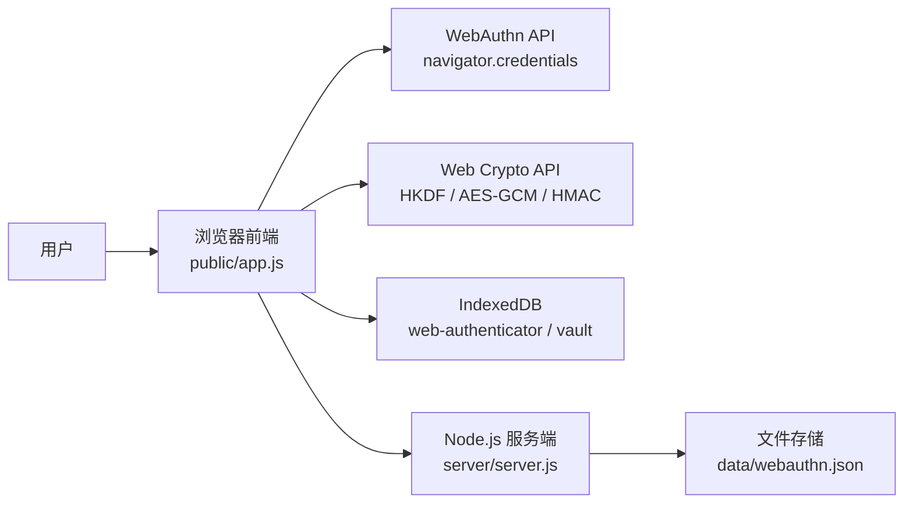
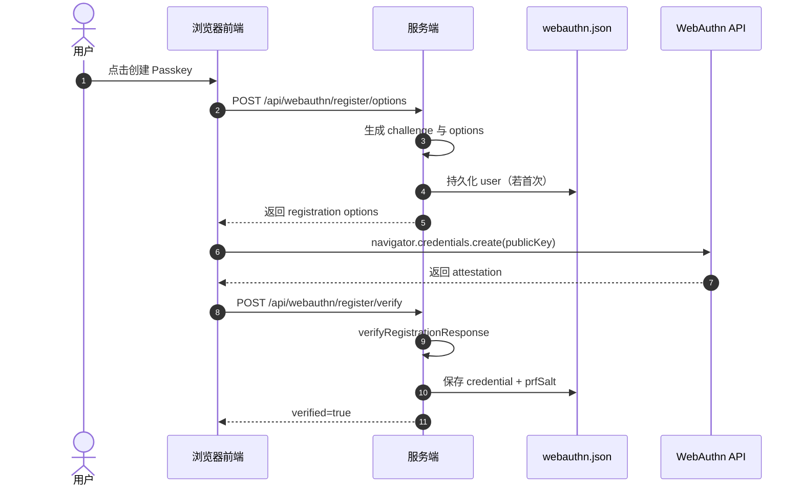
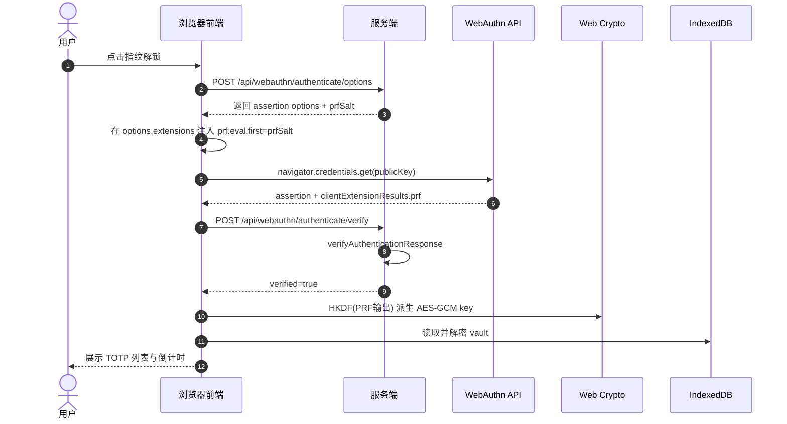
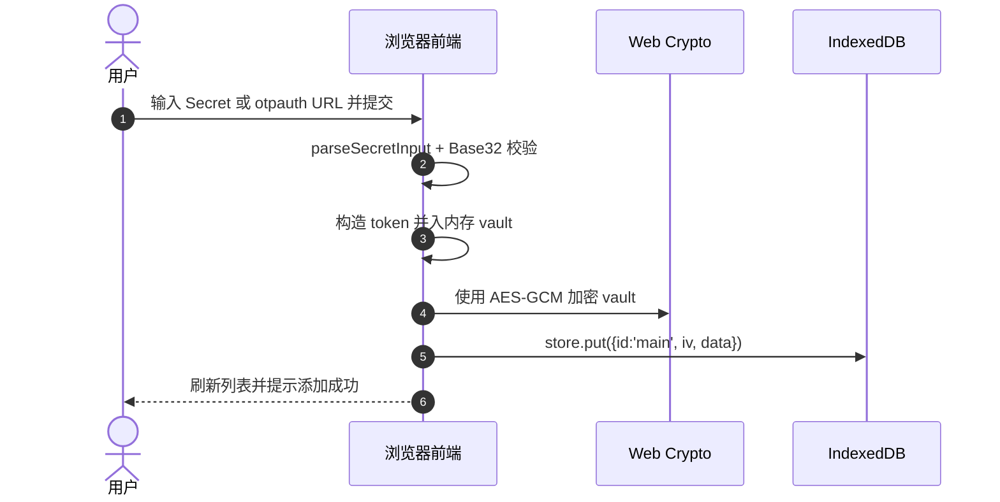

# 系统详细设计（当前实现）

本文描述当前 `web-authenticator` 的实现级设计，覆盖架构、模块职责、关键数据结构、接口契约、安全边界与已知限制。

适用范围：`main` 分支当前代码（截至 2026-02-26）。

## 1. 设计目标与边界

### 1.1 目标
- 提供一个 Web 版 TOTP 管理器，支持新增、展示、复制动态验证码。
- 通过 WebAuthn（Passkey）完成用户验证，利用 PRF 扩展派生本地加密密钥。
- TOTP Secret 仅在浏览器端保存（加密后入 IndexedDB），服务端不保存 Secret 明文。
- 实现轻量单机部署：前后端同进程，最少依赖即可启动。

### 1.2 非目标
- 非多租户/多用户系统，不提供账号体系。
- 非云端同步产品，不提供多设备 Vault 同步。
- 非通用 OTP 平台，目前仅支持 `TOTP`（不支持 `HOTP` 导入和生成）。

### 1.3 使用场景
- 个人账号 2FA 管理：用户在单台设备上集中管理多个站点的 TOTP（如 GitHub、Google、云厂商控制台）。
- 受限网络环境的轻量部署：团队在内网或本机快速启动，使用浏览器与生物识别完成本地保护。
- 强调本地数据主权的场景：不希望将 TOTP Secret 托管到第三方云端，仅允许加密后本地保存。
- 演示与教学场景：用于讲解 WebAuthn、PRF 扩展、Web Crypto 与 TOTP 的端到端实现链路。
- PoC 与二次开发底座：作为后续扩展多用户、审计、同步能力的最小可用原型。

不适用场景：
- 需要多设备自动同步与跨端恢复的生产级 OTP 托管。
- 需要企业级多租户、细粒度权限、集中审计与合规报表的组织化平台。

## 2. 总体架构



架构要点：
- 前端负责：设备能力检测、Passkey 调用、PRF 输出提取、Vault 加解密、TOTP 生成。
- 后端负责：WebAuthn challenge 生成与验签、凭据元数据持久化、时间接口。
- 本地存储分层：
  - `data/webauthn.json`：Passkey 元数据与 `prfSalt`。
  - IndexedDB：加密后的 Vault 二进制密文（`iv + data`）。

## 3. 模块设计

## 3.1 前端模块（`public/app.js`）

职责划分：
- 生命周期与 UI 状态：
  - `init` 绑定事件并触发能力检测。
  - `detectCapabilities` 检测 `SecureContext`、`PublicKeyCredential`、平台认证器可用性。
- Passkey 生命周期：
  - `onRegister`：拉取注册参数、调用 `navigator.credentials.create`、提交验签。
  - `onUnlock`：拉取认证参数、附加 PRF 扩展、调用 `navigator.credentials.get`、提交验签并解锁 Vault。
  - `onLock`：清空会话态密钥与内存 Vault。
- Vault 生命周期：
  - `persistVault`、`encryptVault`、`loadVault`。
  - `openDb`、`saveEncryptedVault`、`loadEncryptedVault`。
- OTP 业务：
  - `parseSecretInput` 支持纯 Secret 和 `otpauth://totp/...`。
  - `base32ToBytes` 解析 Secret。
  - `generateTotp` 使用 HMAC 动态截断算法生成验证码。
  - `startTicker` + `updateTokenDisplay` 每秒刷新倒计时和验证码。
- 工具函数：
  - `coerceToBytes`、`bytesToBase64url`、`base64urlToBytes`、`credentialToJSON`。

关键运行态（`state`）：
- `unlocked`：是否已解锁。
- `key`：由 PRF 输出派生的 AES-GCM 密钥（仅内存）。
- `vault`：解密后的 token 集合（仅内存）。
- `timeSkewMs`：与服务端时间差。
- `ticker`：1s 定时任务句柄。

## 3.2 服务端模块（`server/server.js`）

职责划分：
- HTTP 服务与安全头：
  - Express 静态托管 + API。
  - 设置 CSP、COOP、CORP、`X-Frame-Options`、`Permissions-Policy` 等。
- 会话挑战管理：
  - 使用 `express-session` 保存 `currentChallenge` 与 `challengeType`。
- WebAuthn API：
  - 注册：`/register/options` 与 `/register/verify`。
  - 认证：`/authenticate/options` 与 `/authenticate/verify`。
- 数据持久化：
  - `loadData` / `saveData` 读写 `data/webauthn.json`。
- 编码工具：
  - `bufferToBase64url` / `base64urlToBuffer`。

WebAuthn 库对接点：
- 依赖 `@simplewebauthn/server@11`。
- `allowCredentials[].id` 与 `excludeCredentials[].id` 使用 base64url 字符串。
- 认证验签使用 `verifyAuthenticationResponse({ credential: ... })` 参数结构。

## 3.3 前端页面结构（`public/index.html`）

主要区域：
- 能力检测区：提示设备是否支持 WebAuthn 与平台认证器。
- 注册区：首次创建 Passkey。
- 解锁区：使用生物识别解锁 Vault。
- Vault 区：添加/删除账号、显示动态码、复制、时间校准。
- 状态区：统一反馈成功/失败信息。

## 4. 关键流程

## 4.1 Passkey 注册流程



## 4.2 解锁与解密流程



## 4.3 Token 新增与持久化流程



## 5. 数据模型设计

## 5.1 服务端数据文件（`data/webauthn.json`）

```json
{
  "user": {
    "id": "base64url-user-id",
    "name": "local-user",
    "displayName": "Local User"
  },
  "credential": {
    "id": "base64url-credential-id",
    "publicKey": "base64url-cose-public-key",
    "counter": 0,
    "transports": ["internal", "hybrid"]
  },
  "prfSalt": "base64url-32bytes"
}
```

字段说明：
- `credential.publicKey` 为 COSE 公钥二进制的 base64url 编码。
- `counter` 用于防重放检查（由 authenticator 签名计数推进）。
- `prfSalt` 在首次注册后生成并持久化，作为 PRF 输入固定盐值。

## 5.2 浏览器密文 Vault（IndexedDB）

DB 信息：
- DB 名：`web-authenticator`
- Store：`vault`
- 主键：`id`

记录结构：
```json
{
  "id": "main",
  "iv": "base64url-12bytes",
  "data": "base64url-aes-gcm-ciphertext",
  "updatedAt": 1700000000000
}
```

## 5.3 解密后的 Vault（内存态）

```json
{
  "version": 1,
  "updatedAt": 1700000000000,
  "tokens": [
    {
      "id": "uuid",
      "issuer": "GitHub",
      "account": "user@example.com",
      "secret": "BASE32SECRET",
      "digits": 6,
      "period": 30,
      "algorithm": "SHA-1",
      "createdAt": 1700000000000
    }
  ]
}
```

说明：
- `token._secretBytes` 是运行时缓存字段，不参与持久化。

## 6. API 设计

### 6.1 接口清单
- `GET /api/webauthn/status`：检查是否已注册 Passkey。
- `POST /api/webauthn/register/options`：生成注册参数。
- `POST /api/webauthn/register/verify`：校验注册结果并入库。
- `POST /api/webauthn/authenticate/options`：生成认证参数并返回 `prfSalt`。
- `POST /api/webauthn/authenticate/verify`：校验认证结果并推进计数器。
- `GET /api/time`：返回服务端当前时间戳。

### 6.2 错误处理约定
- 业务失败统一返回 `{ "error": "..." }`。
- 前端 `api()` 对 `!response.ok` 抛出异常并展示到状态区。

## 7. 加密与认证设计

## 7.1 密钥派生链路
- 输入：`clientExtensionResults.prf.results.first`（设备私钥 + `prfSalt` 评估输出）。
- 派生：`HKDF-SHA256`，`salt = empty bytes`，`info = "vault-key"`。
- 结果：`AES-GCM 256` 对称密钥（不可导出，内存态持有）。

## 7.2 Vault 加密参数
- 算法：`AES-GCM`
- IV：每次写入随机生成 `12 bytes`
- 明文：`JSON.stringify(vault)` UTF-8 字节
- 存储：`{ iv, data }` 均为 base64url 字符串

## 7.3 TOTP 生成
- 计数器：`counter = floor(timestamp / 1000 / period)`
- HMAC：`HMAC(algorithm, secretBytes, counterBytes)`
- 截断：RFC 动态截断（31 bit）
- 输出：`mod 10^digits` 并左侧补零

## 8. 安全设计

已实现控制：
- 安全头：CSP、COOP、CORP、`X-Frame-Options`、`Referrer-Policy`。
- 会话 cookie：`httpOnly`、`sameSite=lax`、生产环境 `secure=true`。
- 注册与认证挑战都绑定到服务端会话，流程后清理挑战。
- 强制 `userVerification: required`（生物识别/PIN）。
- 服务端持久化不包含 TOTP Secret。

安全边界说明：
- 服务端泄露风险：可暴露 Passkey 公钥元数据与 `prfSalt`，但不直接获得 Vault 明文。
- 终端风险：若浏览器进程/设备被入侵，内存态解锁密钥与明文 Vault 可能被窃取。

## 9. 配置与部署

环境变量：
- `PORT`：HTTP 端口，默认 `3000`
- `ORIGIN`：WebAuthn 期望源，默认 `http://localhost:3000`
- `RP_ID`：WebAuthn RP ID，默认 `localhost`
- `SESSION_SECRET`：会话签名密钥，生产必须显式设置

部署要求：
- 生产必须使用 HTTPS。
- `ORIGIN` 与 `RP_ID` 必须与实际域名严格匹配。
- 建议启用 NTP，减少 TOTP 漂移。

## 10. 已知限制与技术债

- 单用户、单凭据模型：`webauthn.json` 仅维护一个 `credential`。
- 无服务端限流：认证 API 尚未加入失败次数与速率控制。
- 无密钥轮换机制：`prfSalt` 固定，未提供显式重置流程。
- 无导入导出能力：Vault 不支持安全迁移。
- 无自动化测试：当前缺少接口与端到端测试用例。

## 11. 演进建议

- 引入多用户模型与凭据列表，支持多 Passkey 管理。
- 增加认证失败限流与审计日志。
- 增加 Vault 备份/恢复（带用户口令二次保护）。
- 增加 Playwright E2E（注册、解锁、增删 token、时间校准）。
- 增加 `HOTP` 支持并统一 OTP 抽象层。
